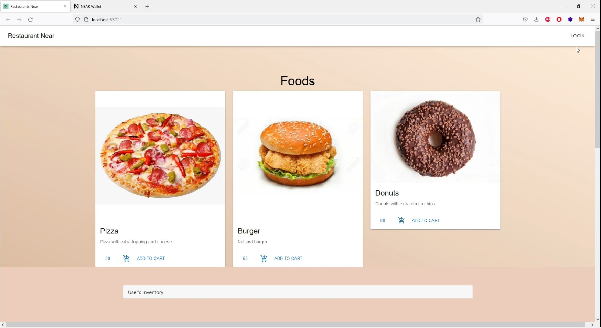
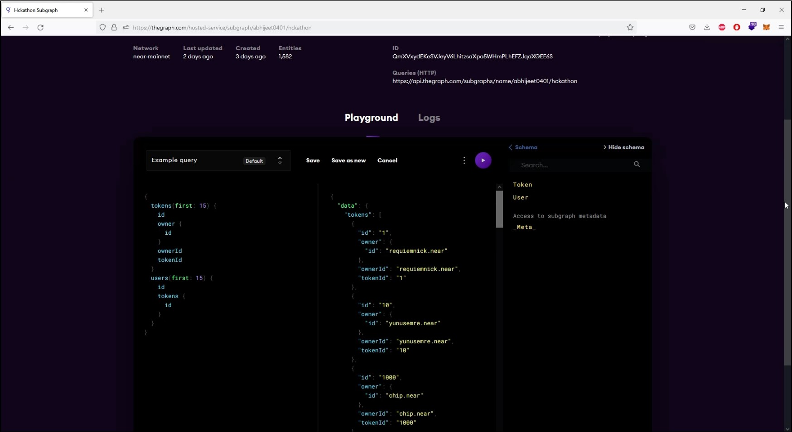
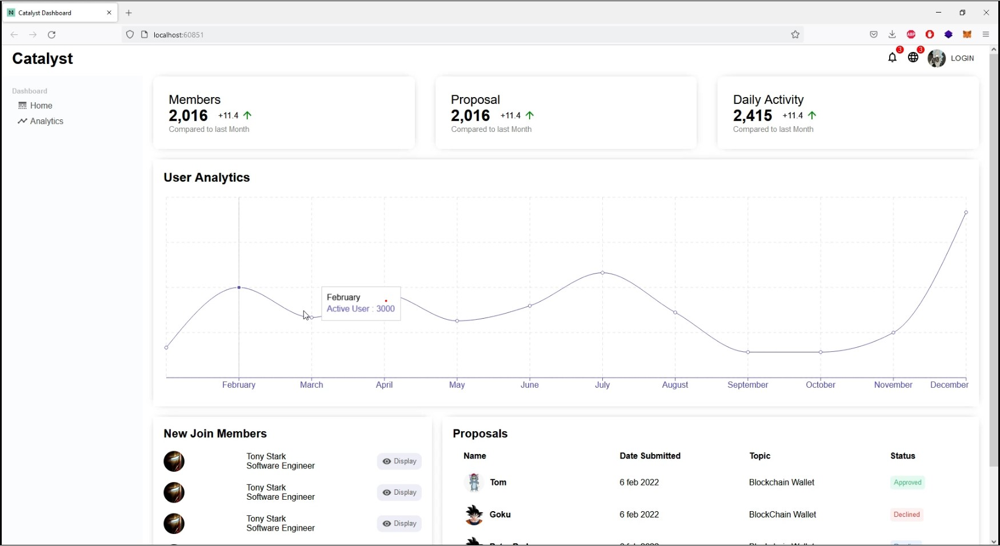
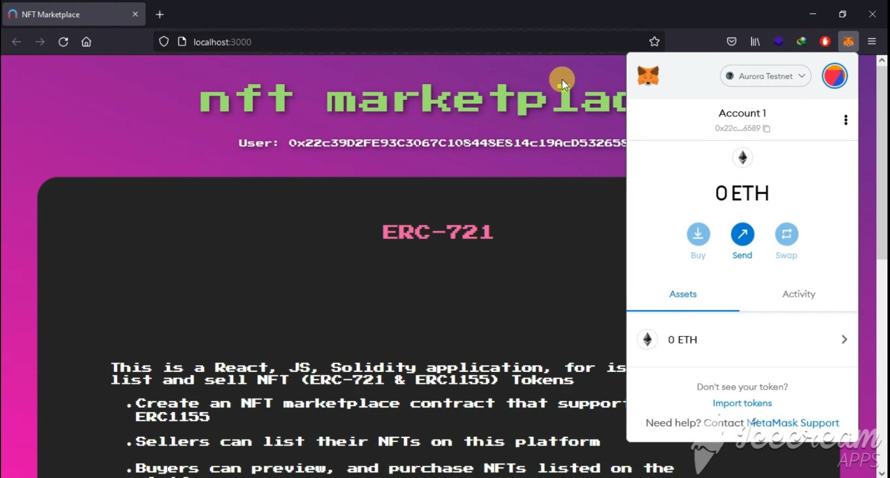

##What is Restaurant Near
In very simplistic language Restaurant Near make life of a vendor and consumer super simple by enabling  cryptocurrency payments from consumers to vendors from a single These autonomous and trust less payments are powered by Near protocol which makes it Super Fast , Super secure and super cheap(in Terms of transaction Fees)

Restaurant Near uses web3.0 methodologies assembly and react is an restaurant to buy and sell food using Near Protocol

Benefits of Restaurant Near for Vendors and Consumers

## VENDORS BENEFITS:

Acceptance of credit card payments generates vulnerability  for sellers for charge backs, which can be extremely hurtful as they incur losses. With crypto currence payments, they do not have to worry about chargebacks.

## CONSUMER BENEFITS:

While Paying a vendor with plastic or digital money such as credit-card, fiat payment gateways these means stores the user sensitive information which can be used to access funds even if the payment is not recurring. This makes users extremely vulnerable as in case of a data leak, their finances will be at risk. With Restaurant Near , only their public wallet address is stored, which cannot be used to access funds.
## SPONSOR CHALLENGES

##The GRAPH

1.	We have build and deploy did registry (did.near) subgraph  on top of Near Protocol awe have used the api to query and show these data on catalytic dashboard . 

2.	Built an NFT subgraph misfits.tenk.near  and API for data from smart contract deployed to NEAR protocol

## The Catalytics Challenge

1.	Built an dashboard for catalyst community which includes graph of member growth , daily activity , proposals and new member joined 

2.	The data for the visualization is coming from the (mock)contract that is deployed to the subgraph

3.	All the dashboard have react components which can be plugged into catalyst platform

## Aurora

## Build an NFT Marketplace 
## Created a working NFT workplace ,which enables user to trade NFTs on Aurora.

1.	NFT marketplace contract that supports ERC721 
2.	Sellers can list their NFTs on this platform
3.	Buyers can preview, and purchase NFTs listed on the platform

## Installation process for NFT Marketplace on Aurora
- Clone this repo
- Run this command `npm install`
- Deploy the contracts on Aurora `truffle deploy --network aurora`
- Test the contract 
- Run the website `npm start`

## Welcome to join in and feel free to contribute.